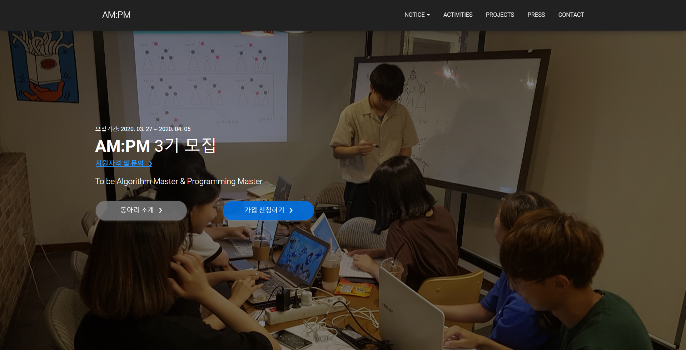

# AM:PM Site
> 전북대학교 소프트웨어공학과 학술동아리 AM:PM 웹 사이트

[![Contributors][contributors-shield]][contributors-url]
[![Forks][forks-shield]][forks-url]
[![Stargazers][stars-shield]][stars-url]
[![Issues][issues-shield]][issues-url]
[![MIT License][license-shield]][license-url]

전북대학교 소프트웨어공학과의 알고리즘 및 프로젝트 관련 학술동아리인 AM:PM 웹 사이트입니다.



[View Site](http://ampm.jbnu.ac.kr)

## Start(아직 이용 불가)

OS X & Linux

```sh
yarn
yarn build && yarn start
```

OS X & Linux Docker(아직 이용 불가)

```sh
sudo docker-compose build
sudo docker-compose up -d
```

## Monitoring(아직 이용 불가)

OS X & Linux

```sh
sudo docker ps
```

## Development setup

프로젝트 폴더 안에서 아래의 명령어를 실행시켜주세요. yarn dev를 실행시키면 next.js의 개발자 모드가 실행되어 auto-hot-reloading 등의 기능을 이용할 수 있습니다.

```sh
yarn
yarn dev
```

## Release History

* 0.0.1
    * Add template and first release

## Meta

Moon Bong-oh – moonbonoz@gmail.com

Distributed under the MIT license. See ``LICENSE`` for more information.

[https://github.com/ampm-jbnu/ampm-site](https://github.com/ampm-jbnu/ampm-site)

## Contributing

1. Fork it (<https://github.com/ampm-jbnu/ampm-site/fork>)
2. Create your feature branch (`git checkout -b feature/fooBar`)
3. Commit your changes (`git commit -am 'add: some fooBar'`)
4. Push to the branch (`git push origin feature/fooBar`)
5. Create a new Pull Request

## Contributors

* Moon Bong-oh [bonomoon](https://github.com/bonomoon)

<!-- MARKDOWN LINKS & IMAGES -->
<!-- https://www.markdownguide.org/basic-syntax/#reference-style-links -->
[contributors-shield]: https://img.shields.io/github/contributors/ampm-jbnu/ampm-site.svg?style=flat-square
[contributors-url]: https://github.com/ampm-jbnu/ampm-site/graphs/contributors
[forks-shield]: https://img.shields.io/github/forks/ampm-jbnu/ampm-site.svg?style=flat-square
[forks-url]: https://github.com/ampm-jbnu/ampm-site/network/members
[stars-shield]: https://img.shields.io/github/stars/ampm-jbnu/ampm-site.svg?style=flat-square
[stars-url]: https://github.com/ampm-jbnu/ampm-site/stargazers
[issues-shield]: https://img.shields.io/github/issues/ampm-jbnu/ampm-site.svg?style=flat-square
[issues-url]: https://github.com/ampm-jbnu/ampm-site/issues
[license-shield]: https://img.shields.io/badge/License-MIT-yellow.svg
[license-url]: https://github.com/ampm-jbnu/ampm-site/blob/master/LICENSE.md
